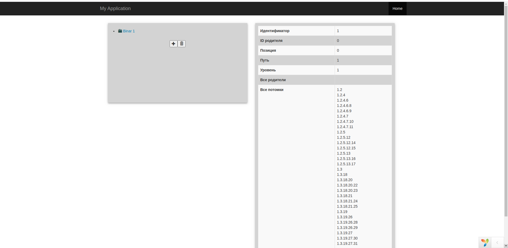
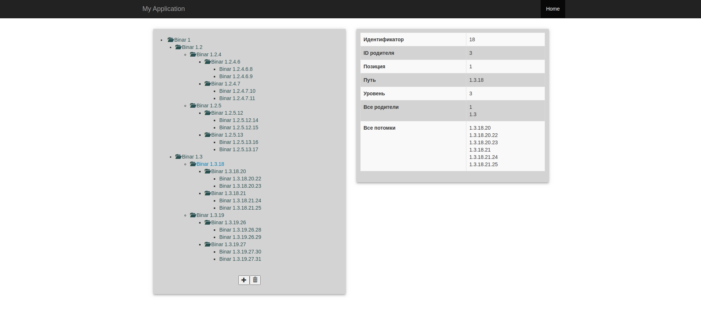
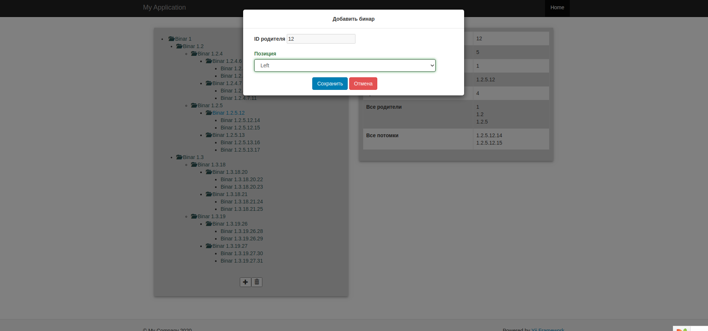

mysql -u root -p
CREATE DATABASE xle;
EXIT;

migrate

1. Добавить недостающие разрешения и роли (из консоли)
   php yii adminxx/common-roles-init

2. Инициализировать новое меню (из консоли), старое - останется.
   php yii adminxx/menu-init
   
3. Инициализировать дефолтных пользователей.
   php yii adminxx/users-init

4 Сщздание администраторов (по выбору)
   php yii adminxx/make-admin

5 Создание суперадмина
   php yii adminxx/make-super-admin

Тестовый бинар

Уствновка для LAMP

sudo mkdir /var/www/test

sudo nano /etc/apache2/sites-available/test.conf
<VirtualHost *:80>
    ServerName test
    DocumentRoot /var/www/test/web
    <Directory /var/www/test>
        AllowOverride All
    </Directory>
</VirtualHost>

sudo nano /etc/hosts
127.0.0.1       localhost
127.0.0.3       test

sudo a2ensite test.conf
sudo systemctl restart apache2

sudo mysql -u root -p
CREATE DATABASE test;
CREATE USER 'test'@'localhost' IDENTIFIED BY '222';
GRANT ALL ON test.* TO 'test'@'localhost' IDENTIFIED BY '222' WITH GRANT OPTION;
FLUSH PRIVILEGES;
EXIT;

cd /var/www/test

git clone https://github.com/OleksiiXle/test_bin.git .

composer update

php yii migrate

Ввести в браузере http://test/

sudo chmod -R 777 /var/www/test/web/assets (если не запустится)

Сразу создается тестовый бинар с 5-ю уровнями и открывается форма для управления ним

 

Бинар предатсвлен в виде дерева, потомки открываются при нажатии на иконку

 
 
Для добавления потомка необходимо выбрать родителя в дереве и нажать кнопку +

 
  
Методы управления бинаром реализованы в классе /var/www/test/models/Binar.php

Метод создания бинара 
    -  makeBinar($parent_id, $position)
    Параметры - parent_id и position для создания ячейки, остальные данные формируются
    автоматически.

Метод автоматического заполнения бинара до 5 уровня, включительно, 
слева направо, сверху вниз
    - makeTestBinars($parent_id=0)
    
Получение всех нижестоящих и вышестоящих ячеек реализованы в виде геттеров
    - getAllParents()
    - getAllChildren()